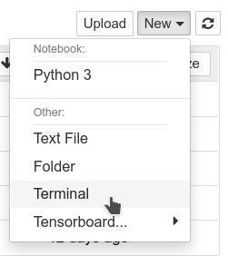

[Back to the previsous section](step1.html)

# Step 2: The Jupyter environment

You are now inside you Jupyter environment. As you can see, it's a web-based environment. But everything you'll do here is in fact happening on the **RHODS** cluster. Meaning that without having to install and maintain anything on your own computer, without even disposing of lots of local resources like CPU and RAM, you can still conduct your Data Science work in this powerful and stable managed environment.

In the "file-browser" like window you're in right now, you'll find the files and folders that are saved inside your own personal space inside **RHODS**. It's pretty empty right now though... So the first thing we will do is to bring the content of the workshop inside this environment.

* On the upper right side click on `New`, then select `Terminal`:

{:refdef: style="text-align: center;"}

{: refdef}

This will open a new Tab on your browser, with access to a prompt.

* From this promt, enter this command to copy the content of the workshop inside your environment:

```bash
git clone https://github.com/rh-aiservices-bu/licence-plate-workshop.git
```

The content is now copied, with something that should look like:
```bash
Cloning into 'licence-plate-workshop'...
remote: Enumerating objects: 92, done.
remote: Counting objects: 100% (92/92), done.
remote: Compressing objects: 100% (71/71), done.
remote: Total 92 (delta 18), reused 78 (delta 11), pack-reused 0
Unpacking objects: 100% (92/92), 20.00 MiB | 542.00 KiB/s, done.
```

* You can now just close this Terminal tab and get back to Jupyter.

[Ready? Let's go to the next section](step3.html)
