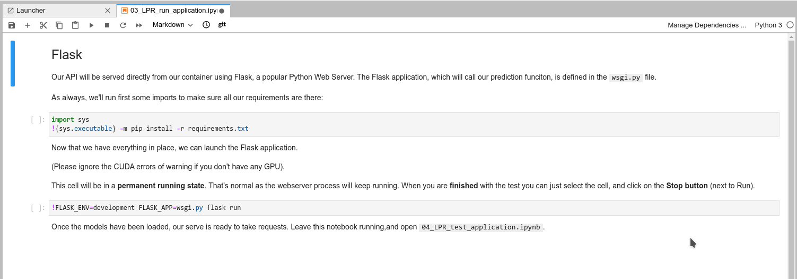

[Back to the previous section](step4.html)

# Step 5: Packaging the model as an API

In the previous section, we learned how to create the code that will be able to extract the number from a given licence plate. But of course we cannot use a notebook like this in a production environment.

So now we will learn how to package this code as an API that you can directly query from other applications.

Some explanations first:

* The code that we wrote in the notebook has been repackaged as a single Python file, `prediction.py`. Basically, it's just the code that was in all the cells of the notebook that was put together inside a single file.

* To use this code as a function you can call, we just added a function called `prediction` that takes a string as an input, the name of the picture, does the recognition, and sends back the result. Open the file directly in Jupyter, see for yourself, you should recognize our previous code, with this new function added.

* There are other files in the folder that are used to provide functions to launch a web server that will be used to serve our API.

After this explanations, you are ready to open the file `03_LPR_run_application.ipynb`, and follow the instructions directly in the notebook!

{:refdef: style="text-align: center;"}

{: refdef}

Once you're finished, you can come back here and [head to the next section](step6.html)
